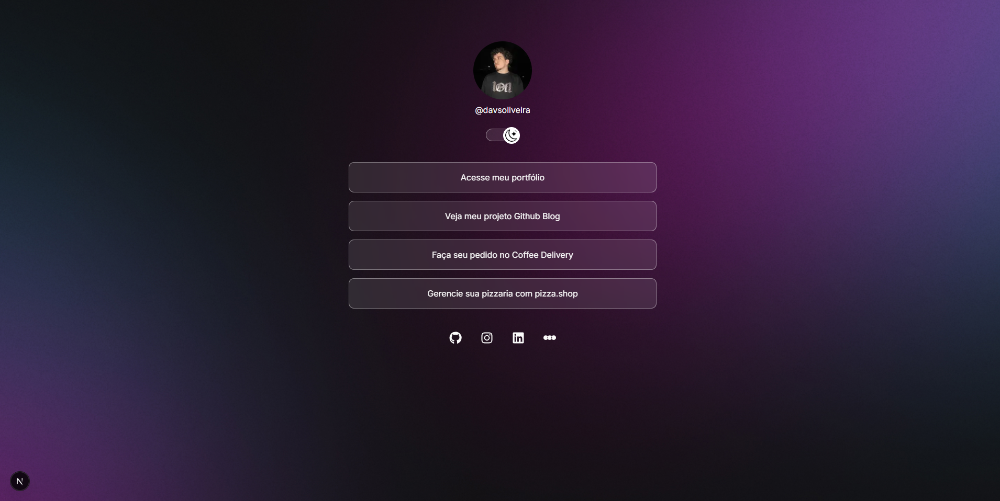
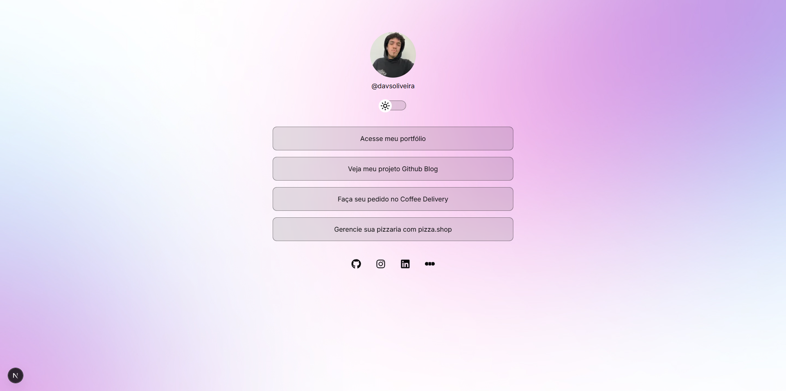

DevLinks

This was the practical challenge in level 01 of Rocketseat's Next.js course.

## [View the project here](https://dev-links-d4v5.vercel.app/)

## Table of contents

- [Overview](#overview)
  - [My Process](#my-proccess)
  - [Screenshots](#screenshots)
- [How to Run the Project](#how-to-run-the-project)
- [Developed with](#developed-with)
- [Author](#author)

## Overview

This project works as a developer-focused Linktree, bringing together important links, social media profiles, and relevant information all in one place.

### My Process

This project was built using Next.js, Tailwind CSS, and TypeScript.
One of the main challenges was integrating the Prismic CMS for content management.
I also developed the functionality that allows users to switch between light and dark themes in the application.

### Screenshots

#### Dark Mode



#### Light Mode



## How to Run the Project

To run the project locally, follow these steps:

1. Clone the repository:

   ```bash
   git clone "https://github.com/davsoliveira/dev-links"

   ```

2. Navigate to the project folder:

   ```bash
   cd dev-links

   ```

3. Install the dependencies:

   ```bash
   npm install

   ```

4. Start the development server:
   ```bash
   npm run dev
   ```

## Developed with

- Typescript
- Next.js
- Tailwind CSS
- shadcn/ui
- Prismic CMS

## Author

- GitHub - [davsoliveira](https://github.com/davsoliveira)
- My portfolio - [Davi Oliveira](https://davsoliveira.github.io/portfolio/)
